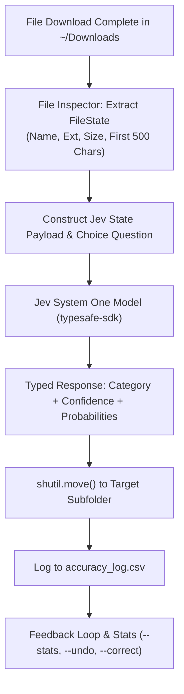

# 📂 Downloads Sorter with Jev

> **Fast, structured file sorting powered by TypeSafe AI's Jev System One decision model, real-time Watchdog folder monitoring, and an active human-in-the-loop feedback loop.**

---

## 🎯 Overview & Purpose

The **Downloads Sorter** monitors your `~/Downloads` directory in real-time. Whenever a new file finishes downloading, it:
1. **Extracts File State**: Extracts file metadata (filename, extension, human-readable size) and the first 500 characters of content (including smart extraction from PDFs, images, and text/code files).
2. **Consults Jev System One Model**: Packages the state and poses a typed **Choice** question to TypeSafe's Jev model across 5 target categories:
   - **`Invoices`**: Receipts, billing statements, fee schedules, payment confirmations, purchase orders.
   - **`Screenshots`**: Screen captures, display snips, UI recordings.
   - **`Code`**: Source code, scripts, configuration files, stylesheets, queries.
   - **`Resumes`**: CVs, resume documents, job application materials.
   - **`Misc`**: General documents, media, archives, installers, and uncategorized files.
3. **Dispatches File Movement**: Moves the file via `shutil.move()` into its categorized destination folder (e.g., `~/Downloads/Invoices/`), with automated collision resolution.
4. **Maintains a Feedback Loop**: Logs the decision, confidence score, and timestamp to a CSV log (`accuracy_log.csv`).
5. **Revert & Correct**: Provides an instant `--undo` CLI flag to revert any mistaken move and records human corrections to calculate a running accuracy metric.

---

## 🏗️ Architecture & Workflow



---

## 📦 Project Structure

```
downloads_sorter/
├── config.py              # Folder categories, criteria definitions & system settings
├── file_inspector.py      # Metadata extraction & content snippet reader (PDF, Image, Text)
├── jev_classifier.py      # TypeSafe Jev SDK integration & System One Choice questions
├── monitor.py             # Watchdog folder observer & automated dispatch pipeline
├── feedback.py            # CSV accuracy logger, undo stack, and metrics tracker
├── sorter.py              # CLI entrypoint supporting --watch, --undo, --stats, --correct
├── requirements.txt       # Project dependencies (typesafe-sdk, watchdog, pypdf, pillow, etc.)
├── .env.example           # Example API key configuration for TypeSafe AI
├── accuracy_log.csv       # Running log of decisions and human corrections
└── tests/
    ├── test_file_inspector.py   # Unit tests for metadata and snippet extraction
    ├── test_jev_classifier.py   # Tests for Choice questions and typed Jev responses
    ├── test_feedback.py         # Tests for accuracy tracking, undo, and corrections
    └── test_integration.py      # End-to-end sorting pipeline integration tests
```

---

## 🚀 Quick Start

### 1. Installation

Clone or open the repository, then install the required dependencies:

```bash
pip install -r requirements.txt
```

### 2. Configure Environment

Copy `.env.example` to `.env` and add your TypeSafe AI API key:

```bash
cp .env.example .env
```

Edit `.env`:
```ini
TYPESAFE_API_KEY=ts_your_api_key_here
# Optional:
# TYPESAFE_BASE_URL=https://api.typesafe.ai
# TYPESAFE_DEFAULT_MODEL=jev-1
```

*(Note: The sorter includes an intelligent local fallback/mock mode, so it also functions seamlessly offline or during testing without an API key).*

---

## 💻 Usage

### 1. Real-Time Folder Monitoring (Default)
Watch your downloads directory in real-time:
```bash
python sorter.py
```
Or specify a custom directory:
```bash
python sorter.py --dir /path/to/my_folder
```

### 2. Revert the Last Move (`--undo`)
Accidentally moved a file? Revert it instantly back to its original location:
```bash
python sorter.py --undo
```
When run interactively, you can also specify the intended category to teach the feedback loop.

### 3. Record a Human Correction (`--correct`)
Correct a past decision by Log Entry ID or Filename:
```bash
python sorter.py --correct 1 Invoices
python sorter.py --correct "sample_code.py" Code
```

### 4. View Running Accuracy & Metrics (`--stats`)
Check your system's performance, confidence levels, and misclassifications:
```bash
python sorter.py --stats
```

Example output:
```
============================================================
📊 JEV DOWNLOADS SORTER — ACCURACY & FEEDBACK LOOP
============================================================
Total Decisions Logged: 12
Current Running Accuracy: 91.7%
Average Confidence:     88.4%
Undone Operations:      1
Human Corrections:      1
------------------------------------------------------------
Category Distribution:
  • Invoices     Predicted: 4   | Actual (Feedback): 4  
  • Screenshots  Predicted: 3   | Actual (Feedback): 3  
  • Code         Predicted: 3   | Actual (Feedback): 3  
  • Resumes      Predicted: 2   | Actual (Feedback): 2  
  • Misc         Predicted: 0   | Actual (Feedback): 0  
============================================================
```

### 5. Sort a Single File Immediately
Test the classifier on an individual file:
```bash
python sorter.py --sort-file ~/Downloads/invoice_2026_q3.pdf
```

### 6. Batch Scan Existing Files
Classify and organize loose files currently in the directory:
```bash
python sorter.py --scan
```

### 7. Simulation / Dry-Run Modes
Preview decisions without moving any files:
```bash
python sorter.py --dry-run
```
Or force local heuristic simulation:
```bash
python sorter.py --mock
```

---

## 🧪 Testing

Run the automated test suite with pytest:

```bash
pytest -v
```

The test suite covers:
- **`test_file_inspector.py`**: Character truncation, format reading, state payload construction.
- **`test_jev_classifier.py`**: Choice question format, criterion matching, typed `SystemOneResponse`.
- **`test_feedback.py`**: Reversible moves, undo stack persistence, feedback metrics computation.
- **`test_integration.py`**: Full pipeline execution (Detect -> Extract -> Classify -> Move -> Log -> Undo).

---

## 💡 Key Design Highlights

1. **Structured Decisions over Text Generation**: Unlike generative LLMs that return conversational text requiring fragile regex parsing, Jev's System One API returns a strongly-typed `ChoiceAnswer` containing the selected choice, confidence float, and full probability distribution.
2. **Zero Polling Delay**: Uses the OS native filesystem event subsystem (`watchdog`) with intelligent debouncing to ensure partial downloads (`.crdownload`, `.part`, `.tmp`) settle before processing.
3. **Continuous Human Feedback Loop**: The combination of `accuracy_log.csv`, `--undo`, and `--correct` creates an audit trail that demonstrates how real-world ML workflows capture user feedback to evaluate model performance over time.
